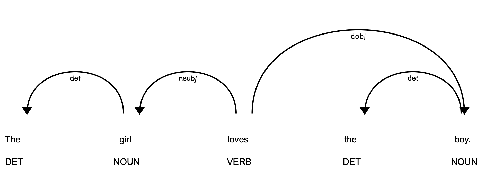
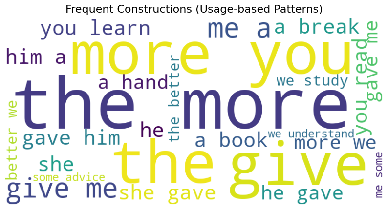

### 2.2.1. Grammatical Structures and Universal Grammar

**Grammatical structures** refer to the systematic patterns that govern **how words, morphemes, and phrases are organized within a language**. These structures provide the **scaffolding for expression, defining permissible word orders, agreement rules, and morphological variations**.

+---------------------------------------------------------------------------------------------------------------------------------------------------------------------------------------------------------------------+
| Example                                                                                                                                                                                                             |
+=====================================================================================================================================================================================================================+
| Subject--verb agreement in English (*She walks* vs. *They walk*) or case marking in Latin illustrates how grammar encodes relationships between sentence elements.                                                  |
|                                                                                                                                                                                                                     |
| Cross-linguistic research shows that while surface grammars vary widely, they often serve parallel communicative and cognitive functions, such as distinguishing subjects from objects or marking tense and aspect. |
+---------------------------------------------------------------------------------------------------------------------------------------------------------------------------------------------------------------------+

The notion of **Universal Grammar (UG)**, most prominently associated with Noam Chomsky (1965, 1981), posits that **humans are born with an innate set of structural principles that constrain the range of possible grammars in natural languages**. According to this theory, linguistic diversity arises not from entirely arbitrary systems but from parameter settings within a universal cognitive framework. Although the universality and innateness of UG remain debated, the concept has been influential in shaping modern linguistics, psycholinguistics, and computational models of language acquisition.

For natural language processing, exploring whether structural patterns generalize across languages has practical implications for building multilingual models and transfer learning systems.

``` python
import spacy
from spacy import displacy

nlp = spacy.load("en_core_web_sm")

# English (SVO) vs. a "synthetic" Latin-like word order
sentences = [
    "The girl loves the boy.",   # Standard English SVO
    "Loves the girl the boy.",   # Same words, unusual order
]

for sent in sentences:
    doc = nlp(sent)
    print(f"\nSentence: {sent}")
    for token in doc:
        print(f"{token.text:<12} {token.dep_:<10} {token.head.text}")

    # Visualize dependencies (inline in Jupyter)
    displacy.render(doc, style="dep", jupyter=True)
```

```         
Sentence: The girl loves the boy.
The          det        girl
girl         nsubj      loves
loves        ROOT       loves
the          det        boy
boy          dobj       loves
.            punct      loves
```



#### What this shows

-   In English, grammar **expects Subject--Verb--Object**: *The girl (subject) → loves (verb) → the boy (object).*

-   If we permute word order (*Loves the girl the boy*), spaCy's parser still tries to assign dependencies, but the sentence feels ungrammatical to native speakers.

-   This illustrates the idea of **language-specific grammatical structures** constrained by deeper principles --- exactly what **Universal Grammar** theory addresses.

### 2.2.2. Usage-based and Cognitive Perspectives

Usage-based approaches to language argue that **linguistic structure emerges from patterns of use rather than from an innate grammar**. From this perspective, frequency, repetition, and context of linguistic forms shape how speakers internalize grammar and meaning. Constructions---form--function pairings such as *give me a break* or *the X-er the Y-er*---are seen as the basic units of grammar, acquired through exposure and reinforced by communicative practice (Bybee, 2010; Goldberg, 2006). Rather than positing abstract universal rules, **usage-based theories emphasize that grammar is a dynamic inventory shaped by experience, interaction, and general cognitive processes like categorization and analogy**.

Cognitive linguistics extends this view by highlighting the **role of conceptualization, embodiment, and mental imagery in structuring meaning**. Language is not an autonomous faculty but is integrated with perception, memory, and reasoning. Metaphor and conceptual blending, for example, reveal how abstract thought is grounded in bodily experience (*time is money*, *ideas are objects*). This orientation aligns with psycholinguistic evidence showing that comprehension and production are influenced by frequency effects, prototype structures, and real-world cognition.

For computational models, usage-based and cognitive perspectives suggest that statistical learning from large corpora and cognitively plausible representations may better capture how humans acquire and process language.

``` python
import spacy
from collections import Counter
from wordcloud import WordCloud
import matplotlib.pyplot as plt

# Load spaCy model
nlp = spacy.load("en_core_web_sm")

# Example text
text = """
The more you read, the more you learn.
Give me a break.
She gave him a book.
He gave me a hand.
The more we study, the better we understand.
Give me some advice.
"""

doc = nlp(text)

# Collect bigrams
bigrams = []
for i in range(len(doc)-1):
    if not (doc[i].is_punct or doc[i+1].is_punct):
        bigram = f"{doc[i].text.lower()} {doc[i+1].text.lower()}"
        bigram = bigram.replace("\n", " ").strip()  # <--- important fix
        bigrams.append(bigram)

# Count frequencies
bigram_freq = Counter(bigrams)

# Generate word cloud
wc = WordCloud(width=800, height=400, background_color="white")
wc.generate_from_frequencies(bigram_freq)

# Display
plt.figure(figsize=(10, 6))
plt.imshow(wc, interpolation="bilinear")
plt.axis("off")
plt.title("Frequent Constructions (Usage-based Patterns)", fontsize=16)
plt.show()
```

{width="715"}
