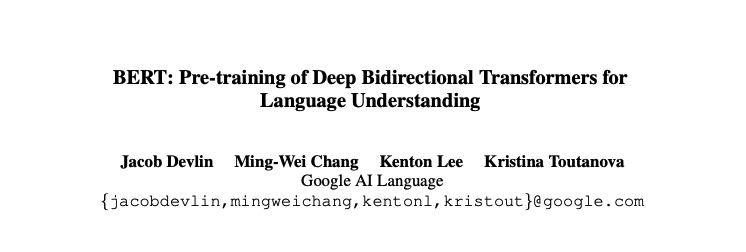
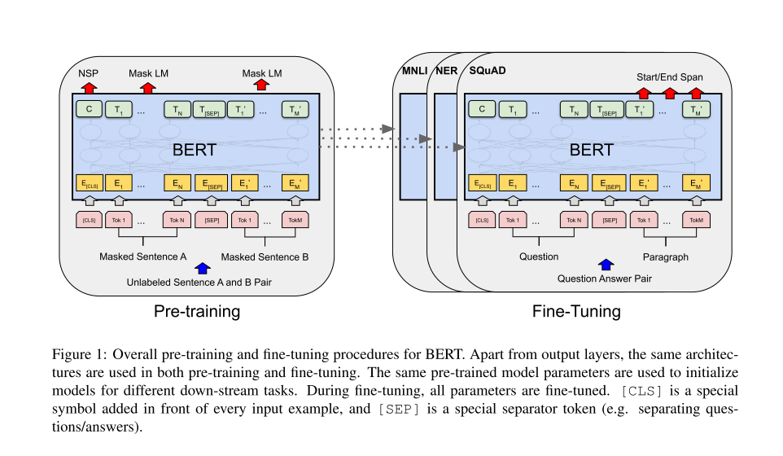

### 5.2.1. Bidirectional Encoder Representations from Transformers

**BERT is the foundation of modern NLP.** Everything since 2018 (including GPT models, Claude, ChatGPT) builds on the Transformer architecture and self-attention mechanism that BERT popularized.



https://arxiv.org/pdf/1810.04805

Graphical representation of the BERT.



**Model configurations:**

-   **BERT-BASE**: 12 layers (L), 768 hidden units (H), 12 attention heads (A) = 110M parameters

-   **BERT-LARGE**: 24 layers, 1024 hidden units, 16 attention heads = 340M parameters

#### Input representation:

Each token's input embedding is the **sum of three embeddings**:

1.  **Token Embedding**: WordPiece tokenization (30,000 vocabulary)

2.  **Position Embedding**: Learned positional encodings (0 to 511)

3.  **Segment Embedding**: Distinguishes Sentence A vs. Sentence B

**Special Tokens:**

-   `[CLS]` - Placed at the beginning; its final hidden state aggregates sequence-level representation

-   `[SEP]` - Separates sentence pairs

-   `[MASK]` - Used during pre-training to mask tokens

#### Self-Attention Mechanism:

The critical innovation enabling bidirectionality:

**For each token, compute:**

> Q = X · W_Q (Query: what am I looking for?)
>
> K = X · W_K (Key: what do I have?)
>
> V = X · W_V (Value: what do I provide?)
>
> Attention(Q,K,V) = softmax(Q·K\^T / √d_k) · V

### 5.2.2. How BERT works?

**BERT is a neural network that reads text bidirectionally to understand context.** Unlike previous models that read left-to-right or right-to-left separately, BERT uses the Transformer architecture with self-attention mechanisms to let **every word "look at" every other word simultaneously**.

It's pre-trained on massive amounts of text using two tasks: (i) predicting randomly masked words (like a fill-in-the-blank exercise) and (ii) determining if two sentences follow each other logically. Each word gets converted into a 768-dimensional vector (embedding) that captures its meaning based on the surrounding context---so "bank" near "river" gets a different embedding than "bank" near "money."

After pre-training, BERT can be fine-tuned on specific tasks like question answering, sentiment analysis, or text classification with minimal additional data.

------------------------------------------------------------------------

**SELF-ATTENTION** is a mechanism that lets each word in a sentence figure out which other words are most relevant to understanding it. Think of it like reading a sentence where every word simultaneously asks "which other words should I pay attention to?" and then updates its meaning based on those relationships.

------------------------------------------------------------------------

+-----------------------------------------------------------------+
| Example                                                         |
+=================================================================+
| ^Sentence: "The bank by the river was flooded"^                 |
|                                                                 |
| ^When processing "bank":^                                       |
|                                                                 |
| ^- Looks at "The" → low attention (0.1)^                        |
|                                                                 |
| ^- Looks at "by" → low attention (0.1)^                         |
|                                                                 |
| ^- Looks at "the" → low attention (0.1)^                        |
|                                                                 |
| ^- Looks at "river" → HIGH attention (0.6) ← relevant context!^ |
|                                                                 |
| ^- Looks at "was" → low attention (0.05)^                       |
|                                                                 |
| ^- Looks at "flooded" → medium attention (0.05)^                |
|                                                                 |
| ^Result: "bank" embedding is heavily influenced by "river"^     |
|                                                                 |
| ^→ BERT understands it's a river bank, not a financial bank^    |
+-----------------------------------------------------------------+

Comparison with ELMo.

------------------------------------------------------------------------

Sentence: "The bank by the river"

ELMo: \[left→\] "The" "bank" "by" + \[←right\] "river" "the" "by"

BERT: "The" ←→ "bank" ←→ "by" ←→ "the" ←→ "river"

(all words attend to all other words at once)

------------------------------------------------------------------------

**Pre-training: Two Unsupervised Tasks**

Task 1: Masked Language Model (MLM)

-   Randomly mask 15% of input tokens

-   **Masking strategy:**

    -   80% → Replace with `[MASK]`

    -   10% → Replace with random token

    -   10% → Keep unchanged

**Objective:** Predict original token using bidirectional context

**Critical insight:** Unlike left-to-right language modeling, MLM forces the model to fuse left AND right context, enabling **deep bidirectionality**. Standard LM can't do this because bidirectional conditioning would allow tokens to "see themselves."

Task 2: Next Sentence Prediction (NSP)

-   Given sentence pairs (A, B):

    -   50% of time: B follows A (IsNext)

    -   50% of time: B is random (NotNext)

**Objective:** Predict whether B actually follows A

**Purpose:** Learn sentence-pair relationships critical for QA and NLI tasks. The `[CLS]` token's representation is used for this binary classification.

**Training Corpus:**

-   BooksCorpus (800M words) + English Wikipedia (2,500M words)

-   1M training steps, batch size 256 sequences (128K tokens/batch)

-   4 days on 4 Cloud TPUs (BERT-BASE) or 16 Cloud TPUs (BERT-LARGE)

#### EXAMPLE

The sentence **"Cat is bad"**

After tokenization with special tokens:

> \[CLS\] Cat is bad \[SEP\]

#### **Step 1: Create Input Embeddings**

Each token gets three 768-dimensional vectors (BERT-BASE) that are **summed**:

```         
Token 0: [CLS]
  Token_Emb_0     = [0.23, -0.45, 0.12, ..., 0.67]  (768 dims)
  Position_Emb_0  = [0.11, 0.08, -0.33, ..., 0.22]  (position 0)
  Segment_Emb_0   = [0.05, 0.02, 0.19, ..., -0.14]  (sentence A)
  ────────────────────────────────────────────────
  X_0 = sum       = [0.39, -0.35, -0.02, ..., 0.75]

Token 1: "Cat"
  Token_Emb_1     = [0.67, 0.23, -0.89, ..., 0.34]
  Position_Emb_1  = [0.14, 0.11, -0.28, ..., 0.19]  (position 1)
  Segment_Emb_1   = [0.05, 0.02, 0.19, ..., -0.14]
  ────────────────────────────────────────────────
  X_1 = sum       = [0.86, 0.36, -0.98, ..., 0.39]

Token 2: "is"
  Token_Emb_2     = [-0.12, 0.56, 0.78, ..., -0.23]
  Position_Emb_2  = [0.17, 0.14, -0.23, ..., 0.16]  (position 2)
  Segment_Emb_2   = [0.05, 0.02, 0.19, ..., -0.14]
  ────────────────────────────────────────────────
  X_2 = sum       = [0.10, 0.72, 0.74, ..., -0.21]

Token 3: "bad"
  Token_Emb_3     = [-0.45, -0.67, 0.23, ..., 0.89]
  Position_Emb_3  = [0.20, 0.17, -0.18, ..., 0.13]  (position 3)
  Segment_Emb_3   = [0.05, 0.02, 0.19, ..., -0.14]
  ────────────────────────────────────────────────
  X_3 = sum       = [-0.20, -0.48, 0.24, ..., 0.88]

Token 4: [SEP]
  (similar process...)
  X_4 = sum       = [0.15, 0.33, -0.45, ..., 0.56]
```

**Result: Input matrix X** (5 tokens × 768 dimensions)

```         
X = [X_0]   [[0.39, -0.35, -0.02, ..., 0.75]
    [X_1] =  [0.86,  0.36, -0.98, ..., 0.39]
    [X_2]    [0.10,  0.72,  0.74, ..., -0.21]
    [X_3]    [-0.20, -0.48,  0.24, ..., 0.88]
    [X_4]]   [0.15,  0.33, -0.45, ..., 0.56]]
```

------------------------------------------------------------------------

#### **Step 2: Layer 1 - Multi-Head Self-Attention**

##### **2a. Compute Q, K, V matrices**

Each token's embedding is multiplied by learned weight matrices:

```         
Q = X · W_Q    (5 × 768) · (768 × 768) = (5 × 768)
K = X · W_K    (5 × 768) · (768 × 768) = (5 × 768)
V = X · W_V    (5 × 768) · (768 × 768) = (5 × 768)
```

**Example for token "Cat" (position 1):**

```         
Q_1 = X_1 · W_Q = [0.86, 0.36, -0.98, ...] · W_Q 
                = [0.54, -0.23, 0.67, ..., 0.12]  (768 dims)

K_1 = X_1 · W_K = [0.86, 0.36, -0.98, ...] · W_K
                = [0.31, 0.88, -0.45, ..., 0.76]  (768 dims)

V_1 = X_1 · W_V = [0.86, 0.36, -0.98, ...] · W_V
                = [0.72, 0.19, 0.33, ..., -0.54]  (768 dims)
```

##### **2b. Calculate attention scores**

For "Cat" to attend to all tokens:

```         
Score = Q_Cat · K^T / √64   (√d_k where d_k = 64 per attention head)

Attention scores for "Cat":
  Q_Cat · K_[CLS] / 8 = 0.54·0.22 + (-0.23)·0.67 + ... = 2.3
  Q_Cat · K_Cat / 8   = 0.54·0.31 + (-0.23)·0.88 + ... = 5.8  ← high!
  Q_Cat · K_is / 8    = 0.54·0.19 + (-0.23)·0.45 + ... = 1.7
  Q_Cat · K_bad / 8   = 0.54·(-0.67) + (-0.23)·0.23 + ... = 4.2  ← relevant!
  Q_Cat · K_[SEP] / 8 = 0.54·0.11 + (-0.23)·0.56 + ... = 1.1
```

##### **2c. Apply softmax to get attention weights**

```         
Scores = [2.3, 5.8, 1.7, 4.2, 1.1]

Softmax:
  exp(2.3) = 9.97
  exp(5.8) = 330.3   ← largest
  exp(1.7) = 5.47
  exp(4.2) = 66.69
  exp(1.1) = 3.00
  Sum = 415.43

Attention weights = [9.97/415.43, 330.3/415.43, 5.47/415.43, 66.69/415.43, 3.00/415.43]
                  = [0.024, 0.795, 0.013, 0.161, 0.007]
                      ↑      ↑              ↑
                   [CLS]   "Cat"          "bad"
```

**Interpretation:** "Cat" pays most attention to itself (79.5%) and significant attention to "bad" (16.1%)

##### **2d. Weighted sum of values**

```         
Output_Cat = 0.024·V_[CLS] + 0.795·V_Cat + 0.013·V_is 
           + 0.161·V_bad + 0.007·V_[SEP]

         = 0.024·[0.23, 0.11, ...] + 0.795·[0.72, 0.19, ...] 
           + 0.013·[0.15, 0.67, ...] + 0.161·[-0.34, -0.89, ...] 
           + 0.007·[0.09, 0.44, ...]

         = [0.52, -0.09, 0.33, ..., 0.18]  (768 dims)
```

**This new representation of "Cat" now contains information from "bad"!**

------------------------------------------------------------------------

##### **2e. Multi-head (repeat 12 times)**

BERT-BASE has **12 attention heads**. Each head learns different relationships:

```         
Head 1: "Cat" → focuses on syntactic role (subject)
Head 2: "Cat" → focuses on semantic connection with "bad"
Head 3: "Cat" → focuses on position in sentence
...
Head 12: "Cat" → focuses on relationship with [CLS] token

Concatenate all 12 heads:
MultiHead_Cat = [Head1_Cat; Head2_Cat; ...; Head12_Cat]
              = [768-dimensional vector]
```

##### **2f. Residual connection + Layer Norm**

```         
# Add original input (residual connection)
X_1_after_attn = X_1 + MultiHead_Cat
               = [0.86, 0.36, -0.98, ...] + [0.52, -0.09, 0.33, ...]
               = [1.38, 0.27, -0.65, ...]

# Layer Normalization (normalize across 768 dimensions)
mean = (1.38 + 0.27 + ... + val_768) / 768 = 0.15
variance = ...

X_1_normalized = (X_1_after_attn - mean) / √(variance + ε)
               = [1.42, 0.14, -0.91, ..., 0.33]  (normalized)
```

------------------------------------------------------------------------

#### **Step 3: Feed-Forward Network**

Each token independently goes through 2-layer FFN:

```         
For "Cat" token:

# First layer: 768 → 3072 dimensions (expansion)
Hidden = GELU(X_1_normalized · W1 + b1)

X_1_normalized · W1 = [1.42, 0.14, -0.91, ...] · [768×3072 matrix]
                    = [0.67, -0.23, 0.89, ..., 0.45]  (3072 dims)

GELU activation (smooth version of ReLU):
  GELU(x) = x · Φ(x)  where Φ is cumulative normal distribution
  
Hidden = [0.55, -0.08, 0.82, ..., 0.39]  (3072 dims)

# Second layer: 3072 → 768 dimensions (projection back)
FFN_Cat = Hidden · W2 + b2
        = [0.55, -0.08, ...] · [3072×768 matrix]
        = [0.34, -0.56, 0.78, ..., 0.22]  (768 dims)
```

#### **Residual + LayerNorm again**

```         
X_1_layer1_output = LayerNorm(X_1_normalized + FFN_Cat)
                  = LayerNorm([1.42, 0.14, ...] + [0.34, -0.56, ...])
                  = [1.23, -0.31, 0.67, ..., 0.44]
```

------------------------------------------------------------------------

#### **Step 4: Repeat for Layers 2-12**

The output from Layer 1 becomes input to Layer 2, and so on:

```         
Layer 1 output → Layer 2 input → Layer 2 output → ... → Layer 12 output
```

**After 12 layers, each token has been refined 12 times:**

```         
Final representation of "Cat" after 12 layers:
  Initial X_1:  [0.86, 0.36, -0.98, ..., 0.39]
  After Layer 12: [0.45, -0.78, 0.23, ..., 0.91]
  
  ↑ This vector now encodes:
    - "Cat" is the subject
    - "Cat" is associated with negative sentiment ("bad")
    - "Cat" appears early in the sentence
    - Full bidirectional context from the entire sentence
```

------------------------------------------------------------------------

#### **Complete Forward Pass Summary**

```         
Input: "[CLS] Cat is bad [SEP]"

┌─────────────────────────────────────────┐
│ Token + Position + Segment Embeddings   │
│ X = (5 tokens × 768 dims)               │
└─────────────────────────────────────────┘
              ↓
┌─────────────────────────────────────────┐
│ Layer 1:                                │
│  • Multi-Head Attention (12 heads)     │
│    - Each token attends to all others   │
│    - "Cat" learns it's related to "bad" │
│  • Feed-Forward Network                 │
│  • Residual + LayerNorm (×2)            │
└─────────────────────────────────────────┘
              ↓
┌─────────────────────────────────────────┐
│ Layer 2:                                │
│  • Refines representations further      │
│  • Captures deeper relationships        │
└─────────────────────────────────────────┘
              ↓
           ... (Layers 3-11)
              ↓
┌─────────────────────────────────────────┐
│ Layer 12:                               │
│  • Final contextualized embeddings      │
└─────────────────────────────────────────┘
              ↓
Output: Contextualized embeddings (5 × 768)
  [CLS]: [0.23, -0.67, 0.89, ..., 0.34]  ← sentence representation
  Cat:   [0.45, -0.78, 0.23, ..., 0.91]  ← "cat" with negative context
  is:    [0.12, 0.34, -0.56, ..., 0.67]  ← linking verb
  bad:   [-0.89, -0.54, 0.12, ..., 0.78] ← negative sentiment
  [SEP]: [0.33, 0.45, -0.23, ..., 0.56]  ← separator
```

### 5.2.3. BERT in Python

Let's play with the "Cat is bad" sentence.

``` python
import warnings
warnings.filterwarnings('ignore')

import os
os.environ['TF_CPP_MIN_LOG_LEVEL'] = '3'  # Suppress TensorFlow warnings

from transformers import BertTokenizer, BertModel
import torch
import numpy as np

print("="*60)
print("BERT: 'Cat is bad' - DETAILED ANALYSIS")
print("="*60)

# Load model
tokenizer = BertTokenizer.from_pretrained('bert-base-uncased')
model = BertModel.from_pretrained('bert-base-uncased')
model.eval()

sentence = "Cat is bad"
print(f"\nInput: '{sentence}'")

# Tokenize
inputs = tokenizer(sentence, return_tensors="pt")
tokens = tokenizer.convert_ids_to_tokens(inputs['input_ids'][0])

print(f"Tokens: {tokens}")
print(f"Token IDs: {inputs['input_ids'].tolist()[0]}")

# Generate embeddings
with torch.no_grad():
    outputs = model(**inputs)

embeddings = outputs.last_hidden_state
print(f"\nOutput shape: {embeddings.shape}")
print(f"  → 1 sentence, {embeddings.shape[1]} tokens, 768 dimensions")

# Extract each token's embedding
print("\n" + "="*60)
print("TOKEN EMBEDDINGS")
print("="*60)

for i, token in enumerate(tokens):
    emb = embeddings[0, i, :]  # [batch=0, position=i, all_dimensions]
    
    print(f"\n{i}. Token: '{token}'")
    print(f"   Shape: {emb.shape}")
    print(f"   First 10 values: {emb[:10].numpy()}")
    print(f"   L2 norm: {torch.norm(emb):.4f}")
    print(f"   Mean: {torch.mean(emb):.4f}")
    print(f"   Std: {torch.std(emb):.4f}")

# Compare "Cat" with "bad"
cat_emb = embeddings[0, 1, :].numpy()  # Position 1
bad_emb = embeddings[0, 3, :].numpy()  # Position 3

# Cosine similarity
def cosine_similarity(a, b):
    return np.dot(a, b) / (np.linalg.norm(a) * np.linalg.norm(b))

similarity = cosine_similarity(cat_emb, bad_emb)

print("\n" + "="*60)
print("SIMILARITY ANALYSIS")
print("="*60)
print(f"\nCosine similarity between 'Cat' and 'bad': {similarity:.4f}")
print("(Higher = more similar, range: -1 to 1)")

# Compare with different context
print("\n" + "="*60)
print("CONTEXT SENSITIVITY TEST")
print("="*60)

sentences = [
    "Cat is bad",
    "Cat is good",
    "Cat is sleeping"
]

cat_embeddings = []

for sent in sentences:
    inputs = tokenizer(sent, return_tensors="pt")
    
    with torch.no_grad():
        outputs = model(**inputs)
    
    # Get "Cat" embedding (position 1)
    cat_emb = outputs.last_hidden_state[0, 1, :].numpy()
    cat_embeddings.append(cat_emb)
    
    print(f"\n'{sent}'")
    print(f"  'Cat' embedding norm: {np.linalg.norm(cat_emb):.4f}")
    print(f"  'Cat' embedding mean: {np.mean(cat_emb):.4f}")

# Compare "Cat" across different contexts
print("\n" + "="*60)
print("'Cat' EMBEDDING COMPARISON ACROSS CONTEXTS")
print("="*60)

for i in range(len(sentences)):
    for j in range(i+1, len(sentences)):
        sim = cosine_similarity(cat_embeddings[i], cat_embeddings[j])
        print(f"\n'{sentences[i]}' vs '{sentences[j]}'")
        print(f"  'Cat' similarity: {sim:.4f}")

print("\n" + "="*60)
print("KEY INSIGHT:")
print("="*60)
print("The same word 'Cat' gets DIFFERENT embeddings based on context!")
print("This is the power of BERT's contextualized representations.")
```

```         
============================================================
BERT: 'Cat is bad' - DETAILED ANALYSIS
============================================================

Input: 'Cat is bad'
Tokens: ['[CLS]', 'cat', 'is', 'bad', '[SEP]']
Token IDs: [101, 4937, 2003, 2919, 102]

Output shape: torch.Size([1, 5, 768])
  → 1 sentence, 5 tokens, 768 dimensions

============================================================
TOKEN EMBEDDINGS
============================================================

0. Token: '[CLS]'
   Shape: torch.Size([768])
   First 10 values: [-0.07808859  0.23633376  0.00748989 -0.19930461 -0.21934718 -0.21074782
  0.22678672  0.32977104 -0.0873947  -0.02356342]
   L2 norm: 14.2931
   Mean: -0.0099
   Std: 0.5160

1. Token: 'cat'
   Shape: torch.Size([768])
   First 10 values: [-0.24112292 -0.3909084   0.49417976 -0.5961284   0.42886347 -0.17034085
  0.8402244   0.5922511   0.2468363  -0.08944406]
   L2 norm: 12.5046
   Mean: -0.0083
   Std: 0.4514

2. Token: 'is'
   Shape: torch.Size([768])
   First 10 values: [-0.4049647  -0.19689023 -0.04476955 -0.4561386   0.5344377   0.01362636
 -0.2565227   0.91136676 -0.29432696 -0.3559795 ]
   L2 norm: 13.3442
   Mean: -0.0105
   Std: 0.4817

3. Token: 'bad'
   Shape: torch.Size([768])
   First 10 values: [ 0.11469449  0.22295797 -0.37003624 -0.29357094 -0.36409536  0.02500957
  0.5872498   0.6286149  -0.7757226  -0.09452349]
   L2 norm: 13.1246
   Mean: -0.0094
   Std: 0.4738

4. Token: '[SEP]'
   Shape: torch.Size([768])
   First 10 values: [ 0.6679046   0.0461308  -0.23258942  0.41409358 -0.35163918 -0.7270919
  0.57082033 -0.45416155  0.34605163  0.4111727 ]
   L2 norm: 15.1586
   Mean: -0.0162
   Std: 0.5471

============================================================
SIMILARITY ANALYSIS
============================================================

Cosine similarity between 'Cat' and 'bad': 0.4708
(Higher = more similar, range: -1 to 1)

============================================================
CONTEXT SENSITIVITY TEST
============================================================

'Cat is bad'
  'Cat' embedding norm: 12.5046
  'Cat' embedding mean: -0.0083

'Cat is good'
  'Cat' embedding norm: 12.5920
  'Cat' embedding mean: -0.0089

'Cat is sleeping'
  'Cat' embedding norm: 13.9256
  'Cat' embedding mean: -0.0107

============================================================
'Cat' EMBEDDING COMPARISON ACROSS CONTEXTS
============================================================

'Cat is bad' vs 'Cat is good'
  'Cat' similarity: 0.9641

'Cat is bad' vs 'Cat is sleeping'
  'Cat' similarity: 0.8413

'Cat is good' vs 'Cat is sleeping'
  'Cat' similarity: 0.8301

============================================================
KEY INSIGHT:
============================================================
The same word 'Cat' gets DIFFERENT embeddings based on context!
This is the power of BERT's contextualized representations.
```

### 5.2.4 BERT's variants and adaptations

But this is only a part of the story. The success of BERT is greatly due to its open-source nature, which has allowed developers to access the source code of the original BERT and create new features and improvements.

This has resulted in a good number of BERT's variants. Below, you can find some of the most well-known variants:

-   **RoBERTa.** Short for "Robustly Optimized BERT Approach'', RoBERTa is a BERT variant created by Meta in collaboration with Washington University. Considered a more powerful version than the original BERT, RoBERTa was trained with a dataset 10 times bigger than the one used to train BERT. As for its architecture, the most significant difference is the use of dynamic masking learning instead of static masking learning. This technique, which involved duplicating training data and masking it 10 times, each time with a different mask strategy, allowed RoBERTa to learn more robust and generalizable representations of words.

-   **DistilBERT.** Since the launch of the first LLMs in the late 2010s, there has been a consolidated trend of building bigger and heavier LLMs. This makes sense, as there seems to be a direct relationship between model size and model accuracy. Yet, it's also true that the bigger the model, the more resources it requires to run, and hence, fewer people can afford to use it. DistilBERT aims at making BERT more accessible by offering a smaller, faster, cheaper, and lighter variant. Based on the architecture of the original BERT, DistilBERT uses knowledge distillation techniques during pre-training to reduce the size by 40% while retaining 97% of its language understanding capabilities and being 60% faster.

-   **ALBERT.** Stands for A Lite BERT, ALBERT was specifically designed to increase the efficiency of BERTlarge during pre-training. As training bigger models often results in memory limitations, longer training times, and unexpected model degradation, ALBERT creators developed two parameter-reduction techniques to reduce memory consulting and increase speed during training.
