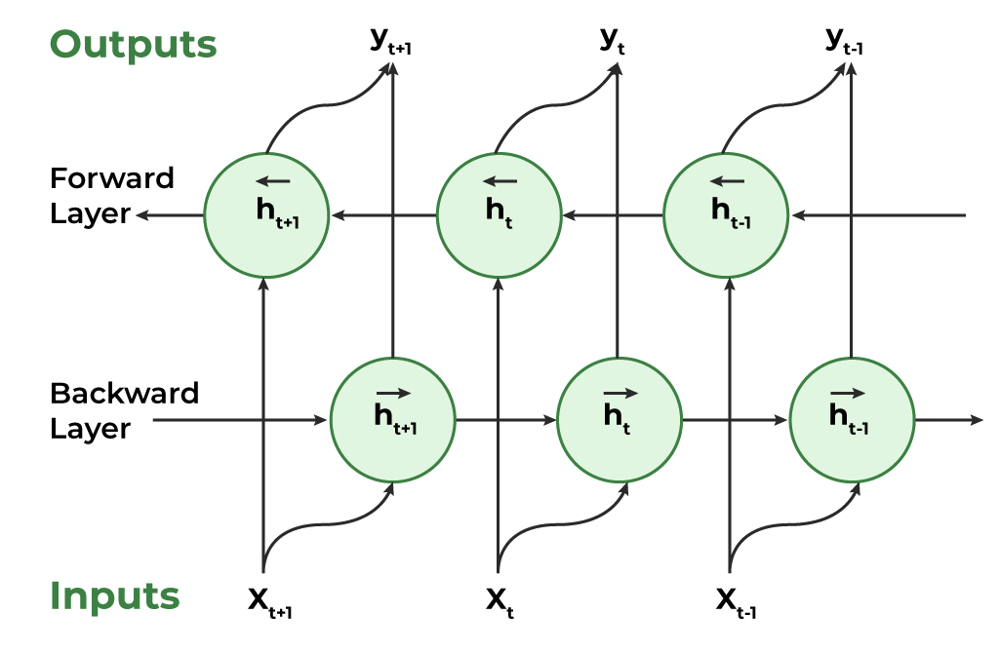

### 5.1.1. Contextual Embeddings

From static embeddings we move to dynamic ones, called "contextual embeddings". Contextual embeddings are word representations that change depending on the surrounding context, unlike static embeddings (Word2Vec, GloVe) where each word has a single fixed vector regardless of how it's used.

The core insight is simple: the word "bank" should have different representations in "river bank" vs. "bank account." Static embeddings can't do this - they assign one vector to "bank." **Contextual embeddings solve this by running the entire sentence through a deep neural network and producing per-token representations that are informed by all the other tokens.**

### 5.1.2. ELMo Essence

**ELMo** (Embeddings from Language Models) uses a bidirectional LSTM. It trains two language models - one reading left-to-right, one right-to-left (bi-directional LSTM) - and concatenates their hidden states at each layer. The final embedding for a word is a learned weighted combination of all layer representations. This was a breakthrough because it showed that different layers capture different linguistic properties: lower layers tend to encode syntax, higher layers encode semantics.

Key characteristics are:

-   **Context-aware**: Word meaning changes with context.

-   **Deep Representations**: Uses multiple layers from the language model.

-   **Pre-trained + Task-specific**: ELMo embeddings are integrated into downstream models and fine-tuned accordingly.

The model uses two separate LSTMs:

-   The forward LSTM reads the sentence from left to right and predicts the next word.

-   The backward LSTM reads from right to left and predicts the previous word.



### 5.1.3. ELMo Usage

If you have problem with version on macos:

``` bash
bash# Uninstall conflicting packages
pip uninstall tensorflow tensorflow-hub tf-keras protobuf -y

# Install compatible versions together
pip install tensorflow==2.15.0 tensorflow-hub==0.15.0 protobuf==3.20.3
```

Simple python implementation:

``` python
import tensorflow as tf
import tensorflow_hub as hub

elmo = hub.load("https://tfhub.dev/google/elmo/3")

def get_elmo_embedding(sentences):
    embeddings = elmo.signatures["default"](tf.constant(sentences))["elmo"]
    return embeddings
  
sentences = [
    "The bank will approve your loan.",
    "He sat by the bank of the river."
]

embeddings = get_elmo_embedding(sentences)
print(embeddings)
```
