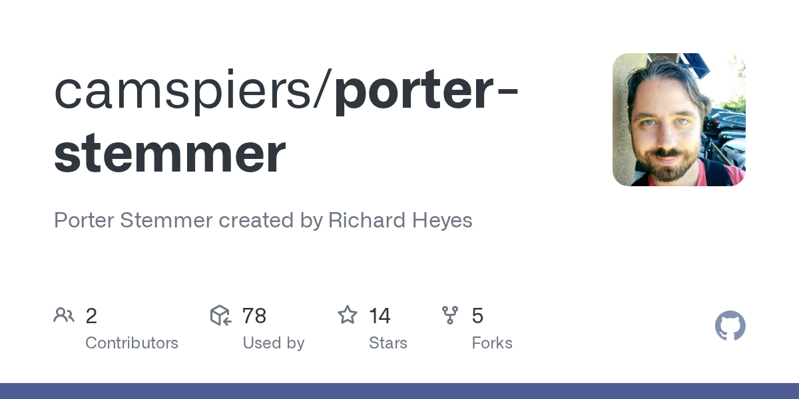

Natural language contains many forms of words (e.g., *run, running, ran, runs*), and reducing them to a common representation is crucial for text analysis. Two fundamental approaches exist: **stemming** and **lemmatization**.

-   **Stemming** applies heuristic rules to truncate words

-   **Lemmatization** uses vocabulary and morphological analysis to return the base or dictionary form (*lemma*).

Both methods aim to normalize text, though they differ in precision, computational cost, and linguistic awareness.

### 3.2.1. Historical Approaches to Stemming

The earliest stemming algorithms were rule-based and heuristic, designed for information retrieval in the 1960s--1980s. The most influential is **Porter\'s stemmer** (Porter, 1980), which reduces words by stripping suffixes with handcrafted rules. For example, *\"connect\", \"connected\", \"connecting\"* all reduce to *\"connect\"*. However, such methods are prone to errors, as they may cut words incorrectly (*\"relational\" → \"relat\"*).

{width="407"}

Below there is an example of Porter's stemmer in Python:

``` python
from nltk.stem import PorterStemmer

ps = PorterStemmer()
words = ["connection", "connected", "connecting", "relational", "cats"]
[ps.stem(w) for w in words]
```

\# Output: \['connect', 'connect', 'connect', 'relat', 'cat'\]

This approach is fast and lightweight, but it ignores deeper linguistic structure.

### 3.2.2. Historical Approaches to Lemmatization

Lemmatization historically required lexicons and morphological analysis, making it computationally heavier than stemming. For example, the **WordNet lemmatizer** (Fellbaum, 1998) uses part-of-speech (POS) information to map *\"running\"* → *\"run\"* or *\"better\"* → *\"good\"*. Unlike stemming, lemmatization ensures that the result is a valid dictionary word.

Example in Python (WordNet Lemmatizer):

``` python
from nltk.stem import WordNetLemmatizer
from nltk.corpus import wordnet

lemmatizer = WordNetLemmatizer()

words = [("running", 'v'), ("better", 'a'), ("cats", 'n')]
[lemmatizer.lemmatize(w, pos=p) for w, p in words]
```

\# Output: \['run', 'good', 'cat'\]

### 3.2.3. Modern Approaches

With the rise of machine learning and deep learning, modern lemmatization and stemming methods increasingly rely on **statistical** or **neural models**. Tools like **spaCy** or **Stanza** perform lemmatization by using pre-trained models that capture both morphology and context. For instance, spaCy can distinguish whether *\"saw\"* refers to the verb (*see*) or the noun (*saw* as a tool).

Example in Python (spaCy):

``` python
import spacy
nlp = spacy.load("en_core_web_sm")

doc = nlp("The children are running with saws in their hands")
[(token.text, token.lemma_) for token in doc]
```

\- Output: \[('The', 'the'), ('children', 'child'),
- ('are', 'be'), ('running', 'run'),

\- ('with', 'with'), ('saws', 'saw'),

\- ('in', 'in'), ('their', 'their'), ('hands', 'hand')\]

### 3.2.4. Comparison of Stemming and Lemmatization

| Feature                    | Stemming                    | Lemmatization                          |
|----------------------------|-----------------------------|----------------------------------------|
| Basis                      | Heuristic rules, truncation | Vocabulary, morphology, POS analysis   |
| Output                     | May not be a valid word     | Always valid dictionary word           |
| Speed                      | Very fast                   | Slower, more computationally expensive |
| Accuracy                   | Lower, may over-truncate    | Higher, preserves semantics            |
| Example (*\"relational\"*) | \"relat\"                   | \"relational\"                         |

In modern NLP pipelines, **lemmatization is preferred** when semantic precision is required (e.g., machine translation, sentiment analysis), whereas **stemming suffices** for tasks like search indexing or clustering where speed matters more than linguistic accuracy.
