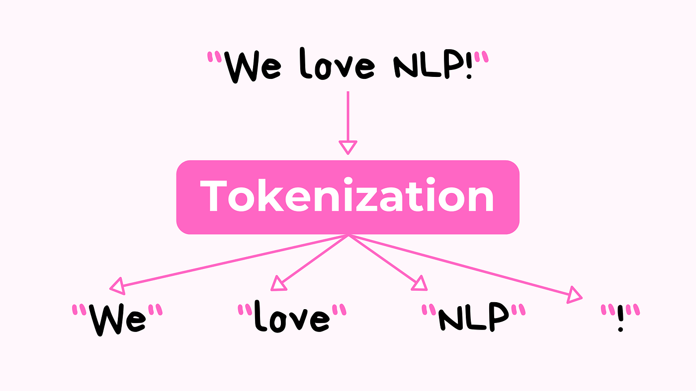

### 3.2.1. Idea Behind

Tokenization is the process of **breaking down text into smaller, meaningful units called *tokens***. These tokens can be **words, subwords, or even individual characters**, depending on the approach. In natural language processing (NLP), tokenization serves as the first preprocessing step that transforms raw text into structured input suitable for computational models. For example, the sentence *"AI transforms society"* might be tokenized into the words *\["AI", "transforms", "society"\]* or, using subword tokenization, into smaller units like *\["A", "I", "trans", "form", "s", "society"\]*.

{width="423"}

Modern NLP often relies on subword tokenization methods such as **Byte Pair Encoding (BPE)** or **WordPiece**, which balance vocabulary size and generalization. These methods allow models to handle rare or unseen words by breaking them into familiar sub-units, improving performance in multilingual and domain-specific contexts. In short, tokenization enables computers to interpret human language by converting unstructured text into analyzable and learnable sequences of tokens (Jurafsky & Martin, 2023).

### 3.2.2. The Future of Tokenization

Tokenization in natural language processing is moving toward more semantically aware and adaptive approaches. Traditional methods, such as whitespace or rule-based splitting, have largely been replaced by subword algorithms like Byte Pair Encoding (BPE) and WordPiece, which balance vocabulary size with coverage. However, these methods still struggle with morphological richness, multilinguality, and context sensitivity. Emerging research focuses on **character-level and byte-level models**, which reduce dependence on handcrafted vocabularies, and **contextual tokenization**, where segmentation dynamically adapts to the meaning of the surrounding text. In addition, **multimodal tokenization**---creating shared representations across text, audio, and images---is becoming increasingly relevant as foundation models expand beyond language. The future of tokenization is therefore likely to involve more universal, efficient, and semantically consistent units, enabling models to better handle diverse languages, dialects, and modalities while reducing biases introduced by rigid token boundaries (cf. Bostrom & Durrett, 2020; Xue et al., 2021).

### 3.2.3. Python Examples

Basic tokenization with "re" Python package.

``` python
import re

text = "Tokenization is the first step in NLP. Let's see how it works!"

# Simple whitespace split
tokens_split = text.split()
print("Split:", tokens_split)

# Regex-based (removes punctuation)
tokens_regex = re.findall(r"\b\w+\b", text.lower())
print("Regex:", tokens_regex)
```

Results:

```         
Split: ['Tokenization', 'is', 'the', 'first', 'step', 'in', 'NLP.', "Let's", 'see', 'how', 'it', 'works!']
Regex: ['tokenization', 'is', 'the', 'first', 'step', 'in', 'nlp', 'let', 's', 'see', 'how', 'it', 'works']
```
