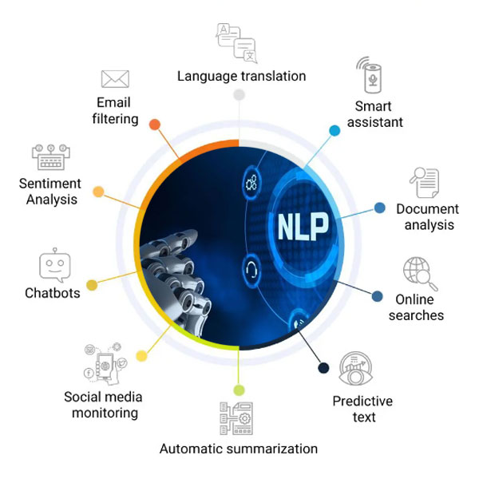
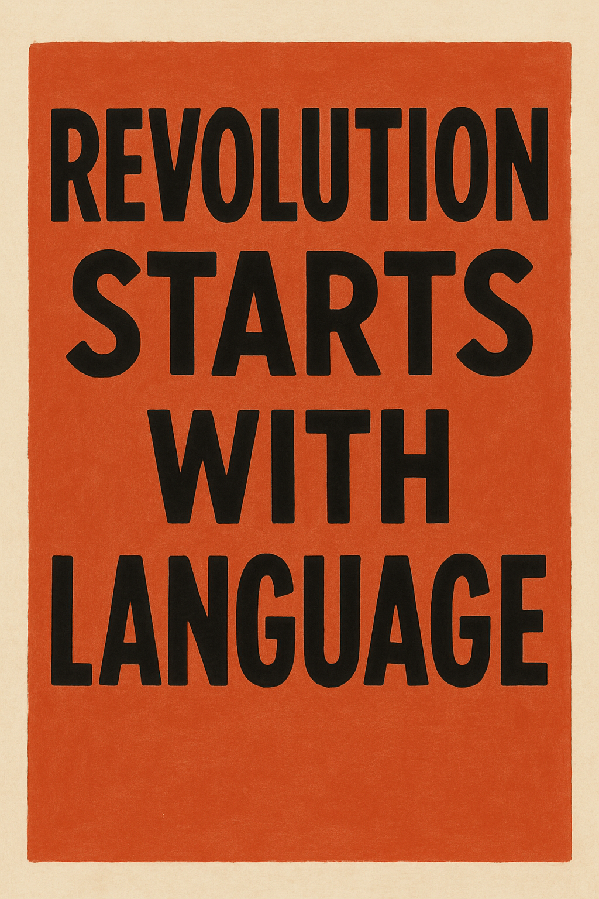

### 1.1.1. Source of Knowledge

Analyzing language is essential because it offers insights into **human cognition, communication, and culture**. It allows us to understand how people think and interact (Chomsky, 2006; Tomasello, 2003), while also preserving cultural heritage by documenting endangered languages (Crystal, 2000). Language analysis supports education by improving literacy and language teaching methods (Snow, 2002), and it drives technological progress in areas such as natural language processing, machine translation, and speech recognition (Jurafsky & Martin, 2023).

It is also a powerful tool in the social sciences, helping to **uncover social dynamics, power relations, and identities** (Fairclough, 2010). Beyond research, analyzing language has practical applications in law, medicine, and everyday communication, ensuring clarity and reducing misunderstandings. In essence, studying language reveals how humans construct meaning and organize societies, while enabling innovations in science, technology, and culture.

### 1.1.2. Source of Money

In recent times, natural language analysis has enabled many technology companies to build applications that have become sources of immense revenue. For example, at the end of 2022, OpenAI, in cooperation with Microsoft, released ChatGPT, which employs highly effective models for natural language analysis. Yet this development is not limited to large language models (LLMs). Voice assistants support us in cars, often serve as the first point of contact on helplines, analyze our emails, and assist doctors in preparing medical documentation. The range of practical applications is already vast, but this is only the beginning of a long journey...

### 1.1.3. Take Away

I remember how the eminent Polish sociologist Prof. Mira Marody used to say at a seminar I had the pleasure of attending: **"Everything begins with language."** This was a reference to the prison writings of the famous Italian representative of the communist movement, Antonio Gramsci: **"Revolution begins with language."**

**Worth remembering:** *"Revolution starts with language.***"**

**This important statement is crucial today, when we are forbidden to speak about many topics and issues...**

### 1.1.4. How to Learn NLP?

There are different approaches to mastering NLP methods and techniques. In fact, combining multiple approaches is recommended for developing expertise in NLP.

*A. Books and articles* (see: below)

*B. Online courses* (e.g. MOOC)

-   **UDEMY**: [**Natural Language Processing with Python**](https://www.udemy.com/course/nlp-natural-language-processing-with-python/?utm_campaign=Search_DSA_Alpha_Prof_la.EN_cc.ROW-English_Subs&utm_source=google&utm_medium=paid-search&portfolio=ROW-English&utm_audience=mx&utm_tactic=nb&utm_term=_._ag_185568237244_._ad_769543047510_._kw_&utm_content=g&funnel=&test=&gad_source=1&gad_campaignid=22894903170&gbraid=0AAAAADROdO2M1sVTHR35dFXiBzgQD0bi4&gclid=Cj0KCQjws83OBhD4ARIsACblj19MIlh1Wmb9qNhqdQ7MHOu4sKJTpbK8ZR-U9uotfoATZDtdSvgI9A4aAhE9EALw_wcB)

-   **COURSERA**: [Natural Language Processing Specialization](https://www.coursera.org/specializations/natural-language-processing)

-   **DATA CAMP**: [Natural Language Processing (NLP) in Python](https://www.datacamp.com/courses/natural-language-processing-nlp-in-python)

*C. Websites*

-   [Medium](https://medium.com/@ageitgey/natural-language-processing-is-fun-9a0bff37854e)

-   [Towards Data Science](https://towardsdatascience.com/category/artificial-intelligence/nlp/)

------------------------------------------------------------------------

**IMPORTANT SOURCE OF NLP MOST INFLUENTIAL ARTICLES**

https://thebestnlppapers.com/nlp/papers/2025/

------------------------------------------------------------------------

**References**

-   Chomsky, N. (2006). Language and Mind. Cambridge University Press.
-   Crystal, D. (2000). Language Death. Cambridge University Press.
-   Fairclough, N. (2010). Critical Discourse Analysis: The Critical Study of Language (2nd ed.). Routledge.
-   Jurafsky, D., & Martin, J. H. (2023). Speech and Language Processing (3rd ed., draft). Stanford University.
-   Snow, C. E. (2002). Reading for Understanding: Toward an R&D Program in Reading Comprehension. RAND Corporation.
-   Tomasello, M. (2003). Constructing a Language: A Usage-Based Theory of Language Acquisition. Harvard University Press.
