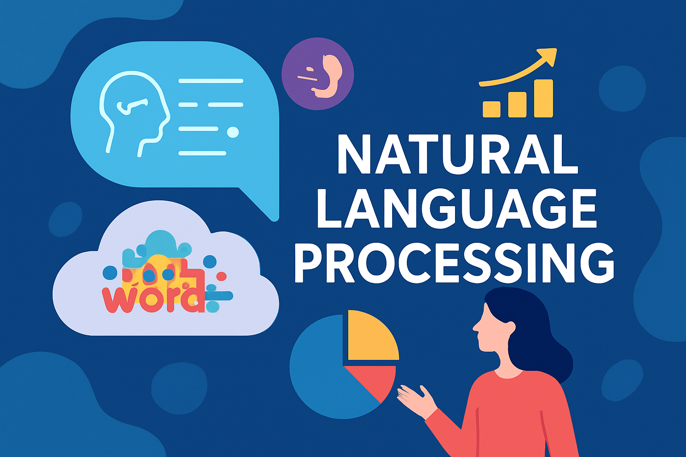

### About the Course

The course is intended for students of analytical programs---especially Business Analytics and Data Science and, as well as Business Analytics---at Maria Curie-Skłodowska University in Lublin (<https://datascience.umcs.pl>). This course is the result of the author's many years of research in natural language processing conducted at the UMCS Center for Artificial Intelligence and Computational Modeling, as well as in business applications. The course has an open and accessible character and is dedicated to anyone who wishes to explore the foundations of Natural Language Processing.

### Why Python?

The course is conducted entirely in **Python**. Despite the author's great fondness for the R language, he considers Python to be superior to R in the fields of NLP and AI.

``` python
# Create an empty list to store the words
words = []

# Open the file "file.txt" in read mode
with open("file.txt") as f:
    # Go through each line in the file
    for line in f:
        # Split the line into separate words
        for word in line.split():
            # Check if the word ends with "ing"
            if word.endswith("ing"):
                # If yes, add it to the list
                words.append(word)

# Display the final list of words
words
```

``` python
# Create an empty list to store the words
words = []

# Open the file "file.txt" and read it line by line
with open("file.txt") as f:
    for line in f:                        # each line in the file
        for word in line.split():         # each word in that line
            if word.endswith("ing"):      # check if it ends with "ing"
                words.append(word)        # add the word to the list

# Show the words as numbered "posts"
for i, word in enumerate(words, start=1):
    print(f"Post {i}: {word}")
```

### AI Use

At many stages of the work, I relied on large language models to produce the best possible teaching materials. Translation, language editing, confronting my own ideas, synthesizing materials, code generation, and explaining certain concepts were supported primarily by ChatGPT. I also used other tools, including Claude.ai.

However, the concept of the textbook, its structure and classifications, as well as the ideas for the content of individual paragraphs, came from me. The ideas for the code, use cases, and the libraries used were mine. I also thoroughly tested the code (mainly in a local Jupyter environment) that was included in the textbook.

Although I have personally read and corrected everything several times, I therefore bear responsibility for the content included. I am aware that there may be fragments that may not fully suit the user.

### About the Author

Director of the Center for Artificial Intelligence and Computer Modeling at Maria Curie-Skłodowska University. Data scientist and sociologist. He completed a postdoctoral fellowship at the Interdisciplinary Center for Mathematical and Computational Modeling at the University of Warsaw. Previously, he worked as a manager and analyst at financial and commercial companies in Poland and the UK. He programs in R and Python. He specializes in deep learning (tensorflow) in the field of natural language processing (NLP). He has led research projects funded by the National Science Center and the Polish Institute of Infrastructure and Development (POIR). He has published in prestigious national and international journals.

### Suggested Sources:

Complete and fantastic book for NLP analysts!

-   Jurafsky, D., J.H. Martin, \[2025\] Speech and Language Processing (3rd ed. draft): <https://web.stanford.edu/~jurafsky/slp3/>

One of the best libraries in Python!

-   <https://www.nltk.org/book/>

Any comments or suggestions may be sent to: **kfilipek\@umcs.pl**
